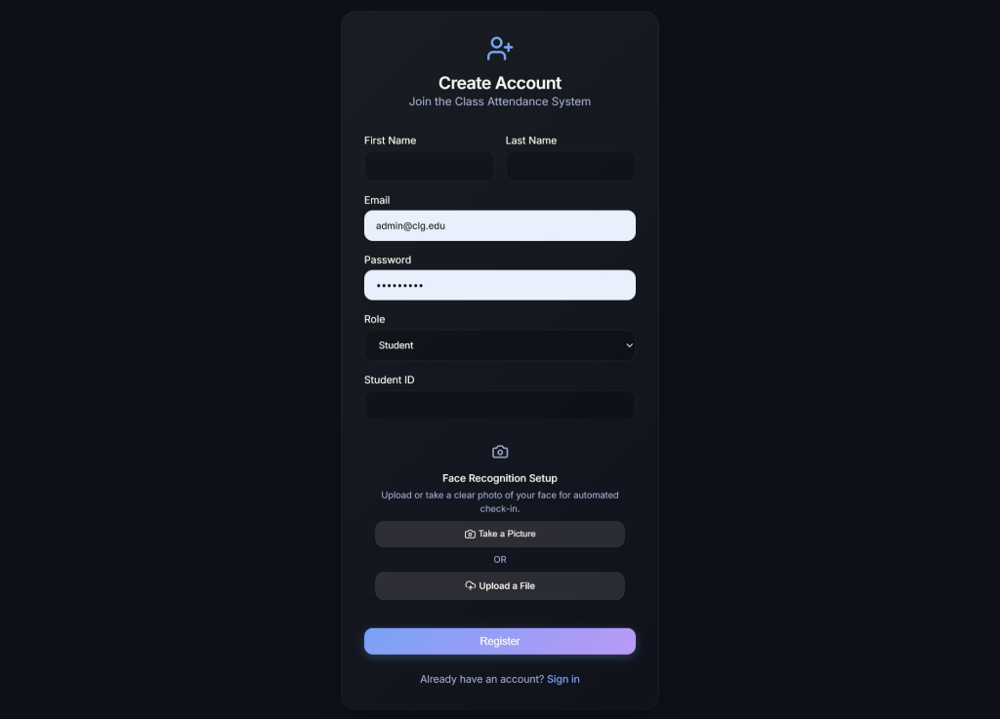
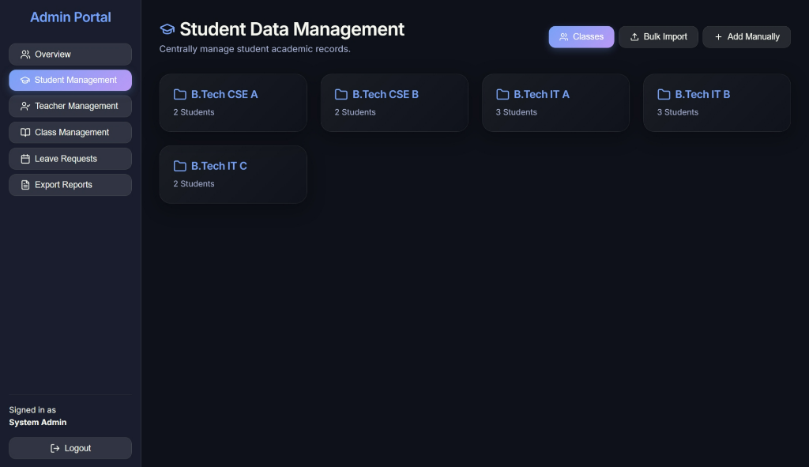
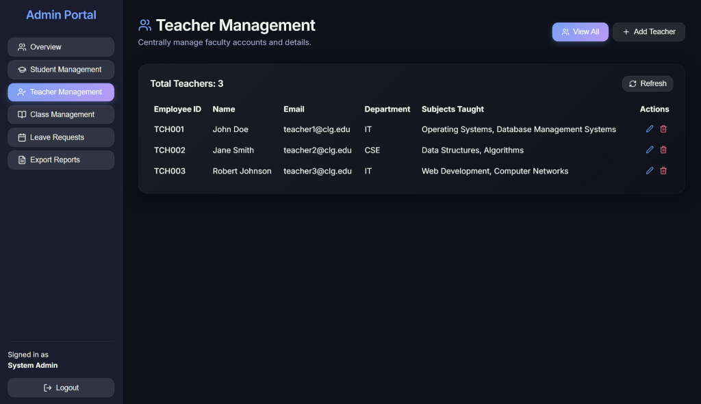
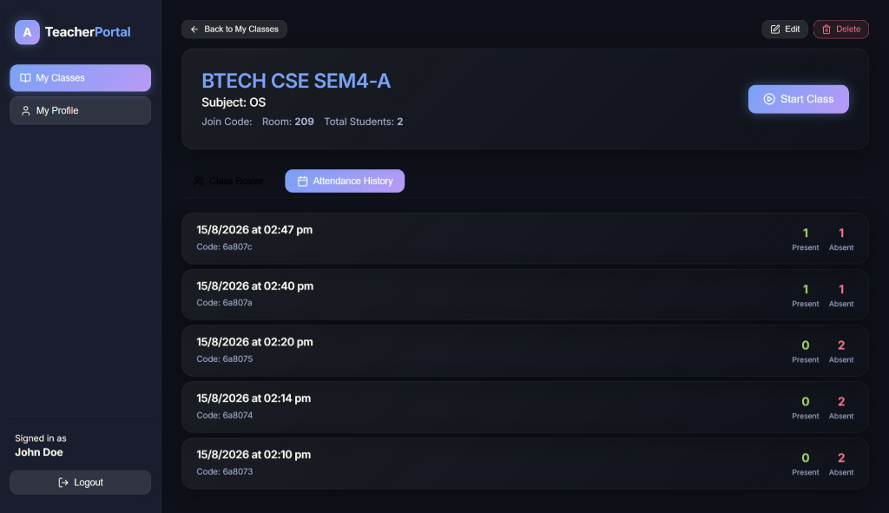
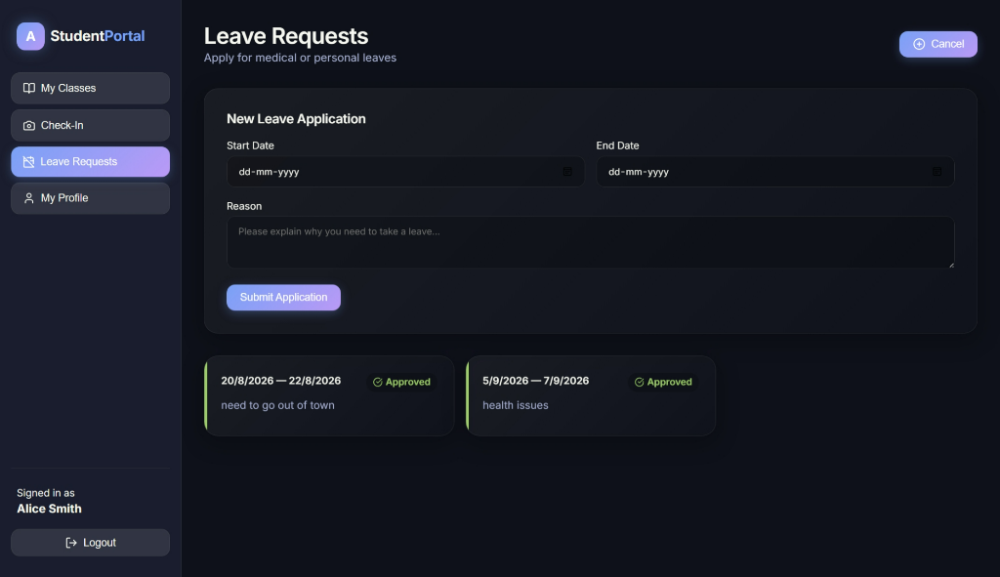
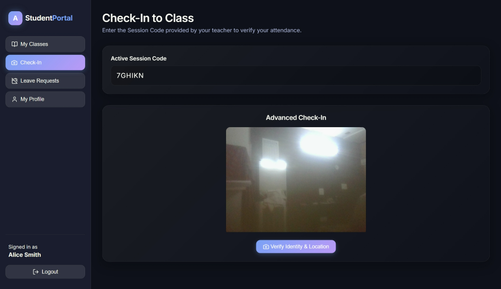
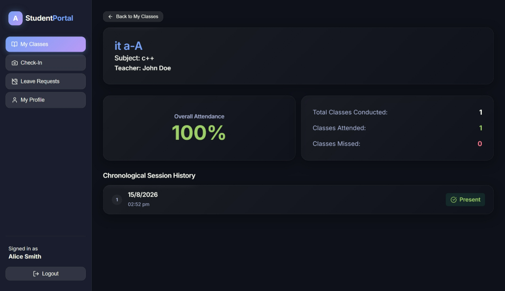

# Class Attendance System

A modern, robust, and secure Class Attendance System built with a Python backend (FastAPI) and a React frontend (Vite). This system utilizes advanced technologies like OpenCV for server-side Face Recognition, rotating QR codes, and browser-based Geolocation checking to prevent check-in spoofing.

## Features
- **Role-based Dashboards:** Dedicated interfaces for Admins, Teachers, and Students.
- **Advanced Check-in:**
  - **Face Recognition:** Powered by OpenCV on the Python backend.
  - **Geolocation Validation:** Ensures the student is physically present in the classroom during check-in.
  - **Rotating QR Codes:** Time-limited QR tokens for quick and secure session joining.
- **Leave Management:** Students can submit leave requests (e.g., medical leave) for Teachers or Admins to approve/reject.
- **Reporting & Analytics:** One-click CSV exports of attendance data for Admins.
- **Rich Aesthetics:** A premium, dark-mode-focused UI built from scratch using glassmorphism, micro-animations, and modern CSS variables.

## Screenshots








## Tech Stack
- **Backend:** Python, FastAPI, Motor (Async MongoDB), Beanie ODM, Passlib (bcrypt), PyJWT, Pytest.
- **Frontend:** React, Vite, React Router, Axios, Lucide-React.
- **Database:** MongoDB (Local or Atlas).

## Project Structure
- `/backend`: Contains the Python FastAPI application, models, routing endpoints, and testing suite.
- `/frontend`: Contains the React/Vite web application, components, and the core design system.
- `/old_node_backend`: Deprecated initial Node.js backend setup.

---

## 🚀 How to Run the Backend

**Prerequisites:** You must have [Python](https://www.python.org/downloads/) installed on your machine. (Make sure to check the box that says "Add Python to PATH" during the installation process).

1. **Navigate to the backend directory:**
   ```powershell
   cd backend
   ```

2. **Create and activate a virtual environment:**
   ```powershell
   python -m venv venv
   .\venv\Scripts\Activate.ps1
   ```
   *(Note: If you are on Mac/Linux, the activation command is `source venv/bin/activate`)*

3. **Install the required Python packages:**
   ```powershell
   pip install -r requirements.txt
   ```

4. **Start the FastAPI development server:**
   ```powershell
   uvicorn main:app --reload
   ```
   *The backend will now be running at `http://localhost:8000`. You can view the automatic, interactive API documentation by visiting `http://localhost:8000/docs` in your browser.*

---

## 🎨 How to Run the Frontend

**Prerequisites:** You must have [Node.js](https://nodejs.org/) installed on your machine.

1. **Navigate to the frontend directory:**
   ```powershell
   cd frontend
   ```

2. **Install the Node dependencies:**
   ```powershell
   npm install
   ```

3. **Start the Vite development server:**
   ```powershell
   npm run dev
   ```
   *The frontend will typically be available at `http://localhost:5173`. Open this link in your browser to view the application.*
